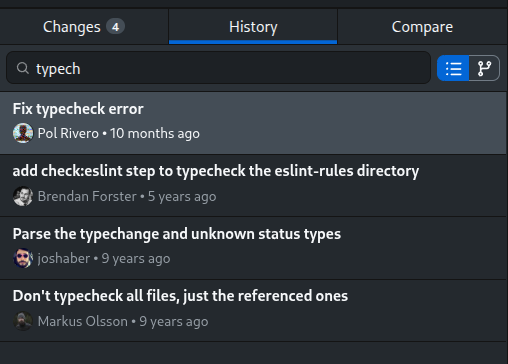
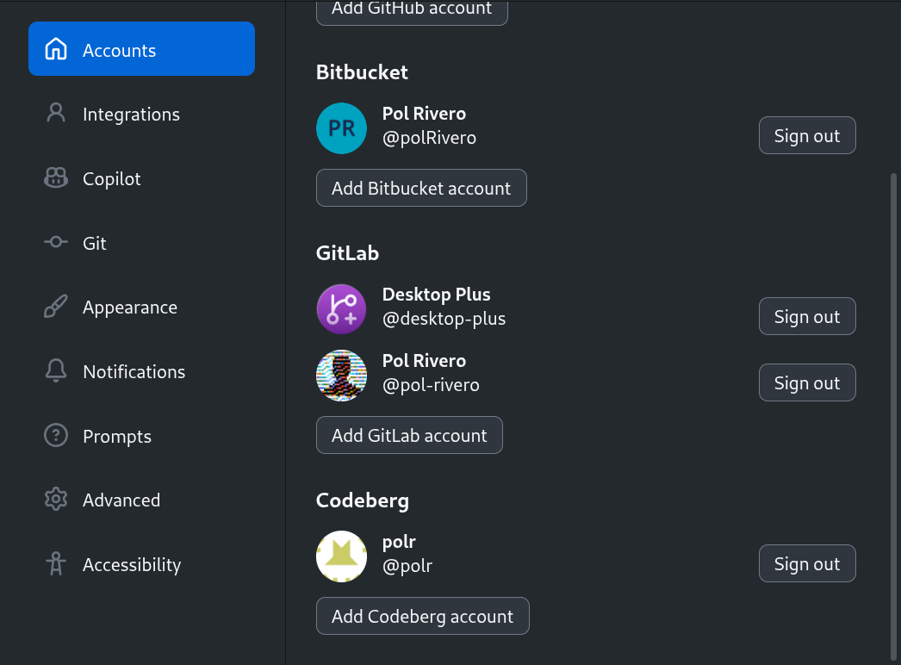
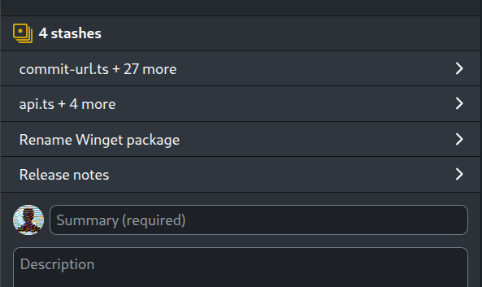
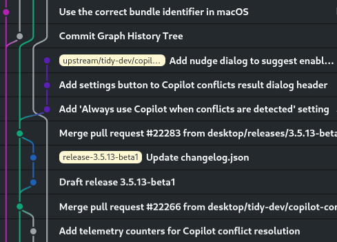
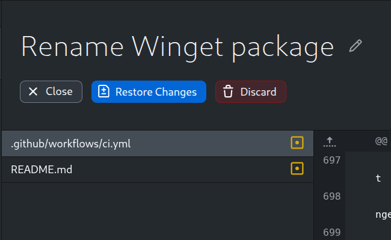
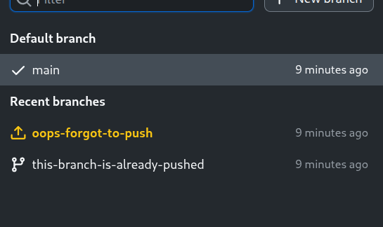
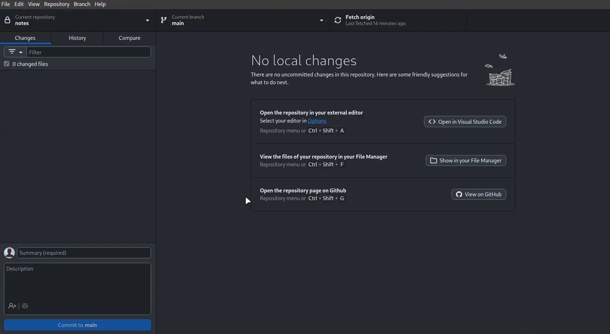

# GH Desktop Plus

This is an **up-to-date** fork of [GitHub Desktop](https://desktop.github.com) with additional features and improvements.

> [!IMPORTANT]
> This is a community-maintained project. It **is not** an official GitHub product. 

## Highlights 👀
| <h4>Search commits by title, message, tag, or hash</h4> | <h4>Add multiple GitHub, Bitbucket & GitLab accounts</h4> |
| :---: | :---: |
|  |  |
| <h4>Create multiple stashes per branch</h4> | <h4>Visualize the Commit Graph</h4> |
|  |  |
| <h4>Buttons optimized for visual recognition</h4> | <h4>Quickly find unpushed branches</h4> |
|  |  |


## Additional Features in GH Desktop Plus ✨

<details>
<summary>Click to expand list</summary>

### General:

- Support for **multiple accounts** of the same endpoint (e.g. multiple GitHub accounts).  
  Simply add as many accounts as you want in the "Accounts" settings page. If a repository is using an incorrect account, you can change it in the repository settings.

- Support for **multiple windows**: open multiple repositories in separate windows, or the same repository in multiple windows (e.g. to view different files at the same time).  
  Select "File" > "Open new window" or press `Ctrl+Alt+N`/`Cmd+Alt+N`. You can also right-click on a repository in the list and select "Open repository in new window".

- **Bitbucket** and **GitLab** integration:
  - Clone repositories from within the app.
  - Preview and create pull requests.
  - View pull requests status, including checks.
  - Display a commit or PR in Bitbucket/GitLab (web browser).
  - Correctly set repository owner (instead of displaying "Other").

  The integration is enabled automatically for the corresponding repositories if you are logged in to your account. 

- Allow using a **different text editor for a given repo**, by overriding it in the repository settings.

- Allow displaying **SVG files as an image** preview in the diff view.

- Some similar-looking buttons now have distinct **icons** for faster visual recognition.

- Buttons with destructive actions have a red background to make them more visually distinct.

- Allow generating **branch name presets** by calling an external script (e.g. fetching ticket numbers from an issue tracker).  
  [Click here for more details](docs/branch-name-presets.md).

- Allow showing the effective **Git name and email** used for commits more prominently above the commit message input.

- Fully disables all the GitHub/Microsoft telemetry from the app.

### Repositories list:

- "**Pull all**" button to fetch and pull all your repositories at once.

- Allow showing the **current branch name** next to the repository name.

- Allow **hiding** the "Recent" repositories section.

- Allow customizing the **repository groups** to better organize your repositories.  
  Right click on a repository and select "Change group name".

- Allow **pinning** repositories to the top of the list.

### Branches list:

- Added a warning indicator to **local-only branches** (branches that have not been pushed to the remote, or that have been deleted automatically after a PR).

- Allow manually setting which is the **default branch** for a repository (even if it doesn't match the one configured in the remote).  
  Right click on a branch and select "Set as default branch". The default branch is used as the base when creating new branches.

- Allow changing the **sort order** of the branch list to either "Recently updated" or "Alphabetical".

### History tab:

- **Search commits** by title, message, tag, or hash.

- Allow switching to a **Commit Graph** view to visualize the merge history.

- Use a different font style for **merge commits** in order to make them visually distinct, since most of the time they are not as relevant.

- Allow choosing between relative dates ("3 days ago") or absolute dates ("Mar 14, 2026, 2:34 PM") for displaying commit dates.

- If a commit modifies only 1 file, allow double-clicking the commit to open the file. For other commits, you can still double-click the file as usual.

- Allow deleting commits and tags that have already been pushed. Please note that this is intended for advanced users only, and can cause problems if the commits have already been pulled by other collaborators.

### Changes tab:

- Added the option to **permanently discard changes** without sending to trash. This is useful when the there are many changed files and the regular "Discard" is extremely slow.

---



</details>

## Download and Installation 📦

### Windows

<details>
<summary>Click to expand</summary>

#### Using Winget (Recommended)

```powershell
winget install polrivero.GitHubDesktopPlus
```

To update, run `winget upgrade polrivero.GitHubDesktopPlus` or `winget upgrade --all` to update all your winget packages. Make sure to update regularly to get the latest features and fixes.

#### Manual download (Not recommended)

Download and execute the installer from the [releases page](https://github.com/desktop-plus/desktop-plus/releases/latest).

| | **64-bit x86** | **64-bit ARM** |
| --- | --- | --- |
| **.EXE Installer** | `-win-x64.exe` | `-win-arm64.exe` |
| **.MSI Installer ⚠️** | `-win-x64.msi` | `-win-arm64.msi` |

Please note that the app doesn't autoupdate like the official GitHub Desktop, so you will need to manually download and install it every time you want to update.  
For this reason, **I recommend using Winget instead of the manual download**.

⚠️ The MSI installer is meant for enterprise deployments and is not recommended for regular users. If you want to use it, keep in mind that that you will need to reboot your computer to finish the installation. The MSI installer only registers a hook that will install the app on login.

---

</details>

### macOS

<details>
<summary>Click to expand</summary>

#### Using Homebrew (Recommended)

```bash
brew install pol-rivero/tap/github-desktop-plus
```

Make sure to run `brew update` regularly to get the latest updates for Desktop Plus.

#### Manual download (Not recommended)

Download and extract the ZIP file from the [releases page](https://github.com/desktop-plus/desktop-plus/releases/latest). Click the app file to run it.  
If you encounter the error "Apple could not verify this app is free of malware", go to "System Settings" > "Privacy & Security", scroll down to "Security" and click "Open Anyway" on "Desktop Plus".

| **64-bit x86** | **64-bit ARM (Apple Silicon)** |
| --- | --- |
| `-macOS-x64.zip` | `-macOS-arm64.zip` |

Please note that the app doesn't autoupdate like the official GitHub Desktop, so you will need to manually download it every time you want to update.  
For this reason, I recommend using Homebrew instead of the manual download.

---

</details>

### Debian / Ubuntu / Linux Mint / Pop!_OS / Zorin OS (APT)

<details>

<summary>Click to expand</summary>
<br>

Create the repository file:

```bash
sudo curl https://gpg.desktop-plus.org/public.key | sudo gpg --dearmor -o /usr/share/keyrings/desktop-plus.gpg
echo "deb [arch=amd64,arm64 signed-by=/usr/share/keyrings/desktop-plus.gpg] https://deb.github-desktop.polrivero.com/ stable main" | sudo tee /etc/apt/sources.list.d/desktop-plus.list
```

Update the package list and install:
```bash
sudo apt update
sudo apt install desktop-plus
```

---

</details>


### Fedora / RHEL / CentOS (RPM)

<details>
<summary>Click to expand</summary>
<br>

Create the repository file:

```bash
sudo rpm --import https://gpg.desktop-plus.org/public.key
echo -e "[desktop-plus]\nname=Desktop Plus\nbaseurl=https://rpm.github-desktop.polrivero.com/\nenabled=1\ngpgcheck=1\nrepo_gpgcheck=1\ngpgkey=https://gpg.desktop-plus.org/public.key" | sudo tee /etc/yum.repos.d/desktop-plus.repo
```

Update the package list and install:

```bash
sudo dnf check-update --refresh
sudo dnf install desktop-plus
```

---

</details>

### OpenSUSE (RPM)

<details>
<summary>Click to expand</summary>
<br>

Create the repository file:

```bash
sudo rpm --import https://gpg.desktop-plus.org/public.key
echo -e "[desktop-plus]\nname=Desktop Plus\nbaseurl=https://rpm.github-desktop.polrivero.com/\nenabled=1\ngpgcheck=1\nrepo_gpgcheck=1\ngpgkey=https://gpg.desktop-plus.org/public.key" | sudo tee /etc/zypp/repos.d/desktop-plus.repo
```

Update the package list and install:

```bash
sudo zypper refresh
sudo zypper install desktop-plus
```

---

</details>


### Arch Linux / Manjaro (AUR)

<details>
<summary>Click to expand</summary>
<br>

Simply install `desktop-plus-bin` from the AUR using your preferred AUR helper.

```sh
yay -S desktop-plus-bin
```

You can also build from source by installing `desktop-plus` or `desktop-plus-git` from the AUR.

> `gnome-keyring` is required and the daemon must be launched either at login or when the X server / Wayland compositor is started. Normally this is handled by a display manager, but in other cases following the instructions found on the [Arch Wiki](https://wiki.archlinux.org/index.php/GNOME/Keyring#Using_the_keyring_outside_GNOME) will fix the issue of not being able to save login credentials.

---

</details>


### Flatpak (any distro)

<details>
<summary>Click to expand</summary>
<br>

Simply install Desktop Plus from [Flathub](https://flathub.org/en/apps/io.github.pol_rivero.github-desktop-plus):

```bash
flatpak install flathub io.github.pol_rivero.github-desktop-plus
```

> **NOTE:** Git hooks will run inside the Flatpak sandbox and cannot access programs installed on your system (such as version managers,
> linters, or other tools your hooks rely on). If your hooks depend on such programs, install a native package instead.

---

</details>

### AppImage (any distro, not recommended)

<details>
<summary>Click to expand</summary>
<br>

**IMPORTANT:** I strongly recommend using your distribution's native package (APT, RPM and AUR packages above) or Flatpak instead of the AppImage, as it requires some manual setup for the sign-in feature to work.  
If you need to use the AppImage, follow these steps:
1. Manually [create a `desktop-plus.desktop` entry](https://wiki.archlinux.org/title/Desktop_entries).
2. Link the MIME type:
   ```sh
   xdg-mime default desktop-plus.desktop x-scheme-handler/x-github-desktop-auth
   ```

#### Using ["AM"/"AppMan"](https://github.com/ivan-hc/AM)

```bash
# If using "AM":
am install github-desktop-plus
# If using "AppMan":
appman install github-desktop-plus
```

#### Manual download (Not recommended)

Download the AppImage from the [releases page](https://github.com/desktop-plus/desktop-plus/releases/latest):

| **64-bit x86** | **64-bit ARM** |
| --- | --- |
| `-linux-x86_64.AppImage` | `-linux-arm64.AppImage` |

Then, make it executable:

```bash
chmod +x DesktopPlus-*-linux-*.AppImage
```

Finally, double-click the .AppImage file to run it.

---

</details>

## Common issues 🛠️

Before opening a new issue, please check the [Known Issues](docs/known-issues.md) document for common issues and their workarounds.

## Command Line Interface 💻

Desktop Plus includes a CLI (`desktop-plus-cli`) for opening and cloning repositories from the terminal. See the [CLI documentation](docs/cli.md) for usage details and instructions on creating a shorter alias.

## Running the app locally 🏗️

### From the terminal

```bash
corepack enable  # Install yarn if needed
yarn             # Install dependencies
yarn build:dev   # Initial build
yarn start       # Start the app for development and watch for changes
```

- It's normal for the app to take a while to start up, especially the first time.

- While starting up, this error is normal: `UnhandledPromiseRejectionWarning: Error: Invalid header: Does not start with Cr24`

- You don't need to restart the app to apply changes. Just reload the window (`Ctrl + Alt + R` / `Cmd + Alt + R`).

- Changes to the code inside `main-process` do require a full rebuild. Stop the app and run `yarn build:dev` again.

- [Read this document](docs/contributing/setup.md) for more information on how to set up your development environment.

### From VSCode

The first time you open the project, install the dependencies by running:
```bash
corepack enable
yarn
```

Then, you can simply build and run the app by pressing `F5`.  
Breakpoints should be set in the developer tools, not the VSCode editor.

### Running tests

I recommend running the tests in a Docker container for reproducibility and to avoid conflicts with your git configuration.  
After installing the dependencies with `yarn`, make sure you have Docker installed and run:

```bash
yarn test:docker
```

## Why this fork?

First of all, because [shiftkey's fork](https://github.com/shiftkey/desktop) is currently unmaintained (last commit was in February 2025), so all Linux users are no longer getting the latest features and fixes from the official GitHub Desktop repository.

Secondly, I think the official GitHub Desktop app is very slow in terms of updates and lacks some advanced features that I'd like. This fork has low code quality requirements compared to the official repo, so I (and hopefully you as well) can add features and improvements quickly.  
This fork also focuses on integrating nicely with Bitbucket, since I use it for work and haven't found a good Linux GUI client for it.

Keep in mind that this version is not endorsed by GitHub, and it's aimed at power users with technical knowledge. If you're looking for a polished and stable product, I recommend using the official GitHub Desktop app instead.

## Acknowledgments 🙏

Application icon adapted from [`git-branch-plus`](https://lucide.dev/icons/git-branch-plus) by [Lucide](https://lucide.dev), [ISC license](https://github.com/lucide-icons/lucide/blob/main/LICENSE).
